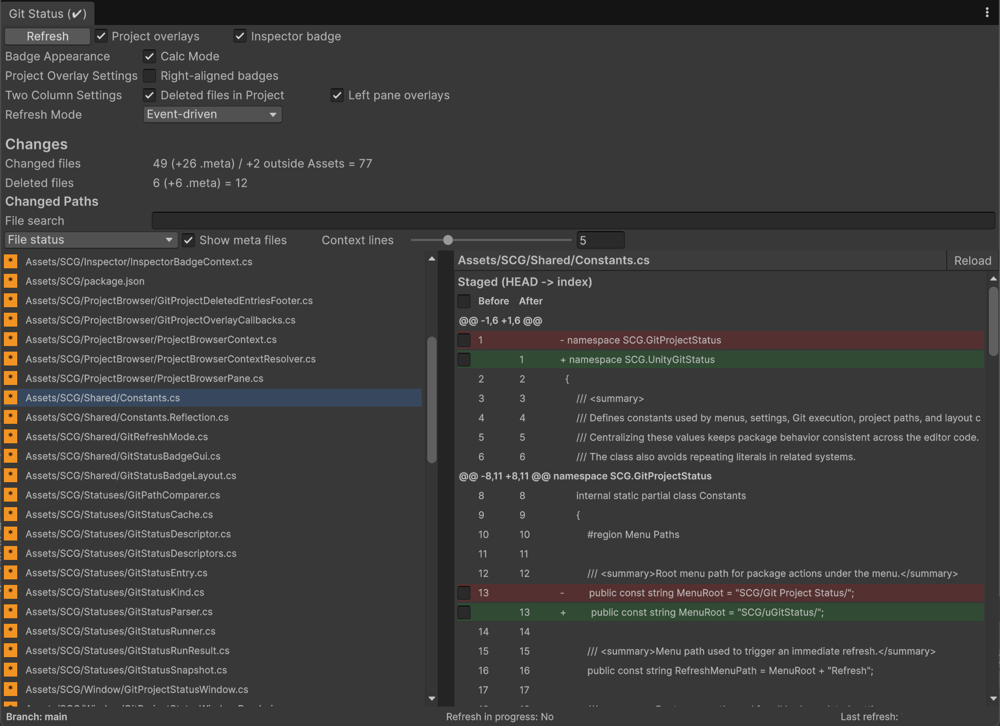
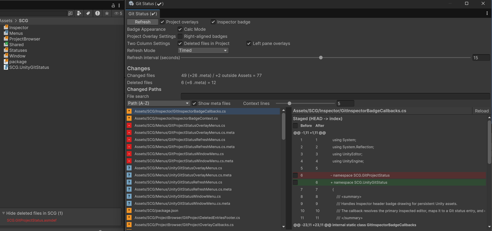
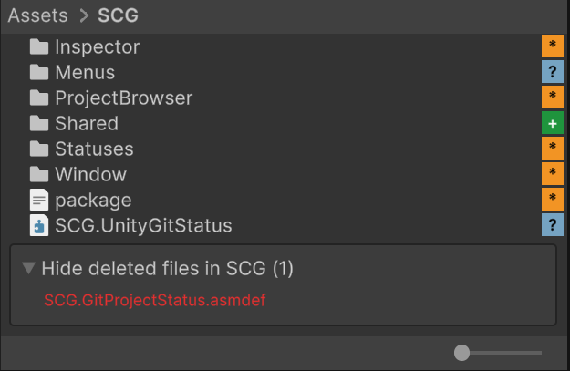
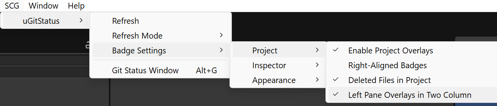

# Unity Git Status

uGitStatus provides lightweight Git status tools for Unity Editor. See file states in Project and Inspector, review diffs line by line, and stage, unstage, or revert selected changes.

The package focuses on keeping repository state visible while you work:

- draw compact badges for changed assets and folders under `Assets/`,
- expose the current branch and changed paths in a small editor window.

The Git Status window also includes an optional unified diff for reviewing staged and unstaged changes and applying focused stage, unstage, or revert actions without turning the package into a full Git client.

## Features

- Resolves the Git repository root with `git rev-parse --show-toplevel`.
- Runs `git --no-optional-locks status --porcelain=v1 -z --untracked-files=all`.
- Normalizes repository-relative paths back to Unity project paths, including monorepo layouts.
- Draws status badges in the Project window for visible assets and parent folders.
- Can draw a matching badge in the primary Inspector header for the currently inspected persistent asset or folder.
- Supports locked Inspector windows by resolving Inspector badge state from the inspected editor target.
- Supports both right-aligned Project badges and Icon-corner Project badges near the asset icon.
- Supports a Calc Mode that swaps letters for symbols in both Project and Inspector badges while keeping the same status colors and tooltips.
- Remaps `.meta` changes to the visible asset or folder whenever possible.
- Shows deleted paths for the active Project folder in a dedicated footer inside the Project window.
- Coalesces refresh requests so repeated editor events do not spawn overlapping Git processes.
- Opens a resizable unified diff when a changed file is selected.
- Stages and unstages selected lines through checked Git patches.
- Reverts selected unstaged lines after explicit confirmation.
- Falls back to whole-file actions for new, deleted, binary, renamed, and copied files.

## Git Operation Scope

uGitStatus does not replace a full Git client. It complements your regular Git workflow by keeping repository status visible and making common staging, unstaging, and revert actions quicker to perform directly in Unity.

uGitStatus intentionally limits repository mutations to staging, unstaging, and reverting the selected file or text lines. It does not commit, branch, push, pull, fetch, stash, browse history, or resolve merges.

Revert permanently discards local working-tree changes and always requires confirmation. New, deleted, binary, renamed, and copied files use whole-file actions because a reliable line-level patch is not available for those cases.

## Requirements

- Unity `2021.3` or newer
- Git available on the system `PATH`
- A Unity project located inside a Git repository

## Installation

1. Open `Window > Package Manager`.
2. Click `+`.

### Git URL

Add the package through Package Manager or `Packages/manifest.json`:

`https://github.com/SpaceCatGames/uGitStatus.git?path=Assets/SCG`

### Local package

1. Choose `Add package from disk...`.
2. Select `Assets/SCG/package.json` from this repository.

## Usage

- Open the window from `SCG > uGitStatus > Git Status Window` or press `Alt + G` (`Option + G` on macOS).
- Select a changed path to open its staged and unstaged unified diff in the resizable right panel.
- Use the changed-path sorting menu to order entries by path, file name, or Git status.
- With a changed path selected and the Git Status window focused, use the Up and Down arrow keys to select the previous or next visible file.
- Select changed lines and use `Stage selected`, `Unstage selected`, or `Revert selected`.
- Set `Context lines` from `1` to `20` to control how many unchanged lines appear before and after each change; the default is `5`.
- Refresh manually from `SCG > uGitStatus > Refresh`.
- Use `SCG > uGitStatus > Refresh Mode` to switch between `Manual Only`, `Timed`, and `Event-Driven`.
- Use `SCG > uGitStatus > Badge Settings > Project > Enable Project Overlays` to turn Project badges on or off.
- Use `SCG > uGitStatus > Badge Settings > Inspector > Enable Inspector Badge` to show or hide the Inspector header badge for the currently inspected persistent asset or folder.
- Use `SCG > uGitStatus > Badge Settings > Appearance > Calc Mode` to swap letter markers for symbol markers.
- Use `SCG > uGitStatus > Badge Settings > Project > Right-Aligned Badges` to switch between the default right-aligned Project placement and Icon-corner Project badges near the asset icon.
- Use `SCG > uGitStatus > Badge Settings > Project > Deleted Files in Project` to show or hide the deleted footer in the Project window.
- Use `SCG > uGitStatus > Badge Settings > Project > Left Pane Overlays in Two Column` to control left-pane badges in two-column Project layout.

## Screenshots

Representative editor views are grouped below. Click any preview to open the full-size image.

### Status window overview

Shows the Git Status window with refresh controls, badge settings, change counts, and the current changed-paths list.

### Project window and status window side by side

Shows the Project window next to the Git Status window, including Project badges and the deleted-paths footer for the active folder.

### Project overlays and deleted footer

Shows right-aligned Project badges together with the deleted-paths footer for the active folder.

### Badge settings menu

Shows the top-level menu structure for refresh actions, badge settings groups, and the Git Status Window command.

The status window shows:

- repository availability in the window title indicator,
- current branch,
- last refresh time,
- refresh activity,
- refresh mode and timed interval,
- optional `.meta` entries in `Changed Paths`,
- visible changed asset count,
- deleted file count.

## Refresh Policy

The package supports three refresh modes.

- `Manual only` disables automatic refresh completely.
- `Timed` refreshes on a configurable interval from `1` to `30` seconds, with `5` seconds as the default.
- `Event-driven` is the default mode.

The current event-driven mode refreshes from:

- editor startup or domain reload,
- editor activation after focus returns to the Unity Editor,
- script compilation finished.

Manual refresh is always available from the status window or from the SCG menu.

Refresh mode is stored in editor settings and can be switched from the status window or from the dedicated `Refresh Mode` submenu.

If a refresh is already running, the package keeps at most one follow-up refresh pending.

## Status Markers

| Marker      | Status     | Color            |
| :---------: | ---------- | ---------------- |
| `M` / `*`   | Modified   | Yellow / orange  |
| `A` / `+`   | Added      | Green            |
| `D` / `-`   | Deleted    | Red              |
| `R` / `±`   | Renamed    | Purple / magenta |
| `C` / `/`   | Copied     | Cyan             |
|    `?`      | Untracked  | Blue / gray      |
|    `!`      | Conflicted | Bright red       |
| `I` / `X`   | Ignored    | Muted gray       |

Folder markers use the highest-priority descendant status:

1. Conflicted
2. Deleted
3. Renamed
4. Added
5. Modified
6. Copied
7. Untracked
8. Ignored

## Deleted Files

Deleted assets often no longer have a visible row or GUID in the Project window list.

When Git reports deleted paths under the currently opened Unity folder, the package shows them in a dedicated footer at the bottom of the Project window.

The footer can be collapsed so it does not get in the way, and deleted file paths are no longer duplicated in a separate `Deleted Files` section inside the status window.

Tracked deleted files can be restored from the Git Status window with `Revert file` after explicit confirmation.
If the deletion is staged, use `Unstage file` first; `Revert file` becomes available after the deletion returns to the unstaged state.
The Project-window footer itself remains status-only and does not expose restore or checkout actions.

## Design Notes

- `git status --porcelain=v1 -z` is used because it is stable for tooling and preserves paths with spaces.
- `git --no-optional-locks` avoids optional Git index locks during editor refreshes.
- `.meta` paths are remapped because Unity displays the asset or folder, not the `.meta` file itself.
- Deleted entries are tracked separately from visible asset badges so a deleted child file does not make its parent folder look deleted.
- Rename and copy records preserve both paths. In porcelain v1 `-z`, Git emits the new path first and the source path as the next null-delimited token.
- The Inspector badge resolves status from the inspected editor target and reconstructs header geometry from the same Unity header layout data used by `Editor.DrawHeaderGUI`.
- The package intentionally stays small and editor-only.

## Troubleshooting

- `Git process could not be started`: install Git and make sure `git` is available on the system `PATH`.
- `No Git repository found at or above the Unity project root`: open a Unity project whose root or parent folder is tracked by Git.
- Paths with spaces are supported because Git commands use `ProcessStartInfo.WorkingDirectory`.
- Large repositories may refresh more slowly because Git status still has to scan the working tree.

## Compatibility Notes

- Unity `2021.3` is the minimum supported editor version.
- The Project Browser integration relies on reflection against Unity editor internals, so long-term compatibility depends on those internal APIs remaining stable.
- The Inspector badge mirrors Unity's large-header layout data to stay aligned with the built-in header across supported editor versions.

## License

MIT License

Permission is hereby granted, free of charge, to any person obtaining a copy
of this software and associated documentation files (the "Software"), to deal
in the Software without restriction, including without limitation the rights
to use, copy, modify, merge, publish, distribute, sublicense, and/or sell
copies of the Software, and to permit persons to whom the Software is
furnished to do so, subject to the following conditions:

The above copyright notice and this permission notice shall be included in all
copies or substantial portions of the Software.

THE SOFTWARE IS PROVIDED "AS IS", WITHOUT WARRANTY OF ANY KIND, EXPRESS OR
IMPLIED, INCLUDING BUT NOT LIMITED TO THE WARRANTIES OF MERCHANTABILITY,
FITNESS FOR A PARTICULAR PURPOSE AND NONINFRINGEMENT. IN NO EVENT SHALL THE
AUTHORS OR COPYRIGHT HOLDERS BE LIABLE FOR ANY CLAIM, DAMAGES OR OTHER
LIABILITY, WHETHER IN AN ACTION OF CONTRACT, TORT OR OTHERWISE, ARISING FROM,
OUT OF OR IN CONNECTION WITH THE SOFTWARE OR THE USE OR OTHER DEALINGS IN THE
SOFTWARE.
